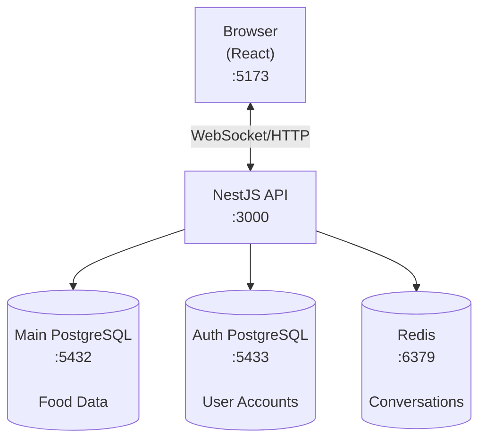

# NL2SQL Project - Agent Instructions

## Project Overview

**Full-stack Natural Language to SQL application** that allows users to query a USDA food nutrition database using natural language. The system uses OpenAI's function calling to convert questions into SQL, executes them, and returns results in a conversational format.

**Example**: "What foods have the most vitamin C?" → System generates SQL → Returns ranked list of foods

## Workspace Structure

```
nl2sql/
├── nl2sql-backend/     # NestJS API server (see backend/AGENTS.md)
└── nl2sql-frontend/    # Vite + React client (see frontend/AGENTS.md)
```

**See workspace-specific AGENTS.md files for detailed instructions:**

- [Backend Guide](nl2sql-backend/AGENTS.md) - NestJS, Prisma, OpenAI, WebSocket
- [Frontend Guide](nl2sql-frontend/AGENTS.md) - React, Zustand, Socket.io-client

## Quick Start (Full Stack)

### Prerequisites

- Docker & Docker Compose
- OpenAI API key (get from https://platform.openai.com)

### Setup with Docker Compose

**1. Backend Setup**

```bash
cd nl2sql-backend

# Create environment file
cp .env.example .env

docker compose up --build -d

```

**2. Frontend Setup**

```bash
cd ../nl2sql-frontend

# Create environment file
cp .env.example .env

docker compose up --build -d
```

**3. Create Admin User**

```bash
cd nl2sql-backend

# Seed auth database
docker compose exec app npm run auth:seed
```

**If you need to reset everything:**

```bash
cd nl2sql-backend

docker compose exec app npm run db:reset

docker compose exec app npm run auth:reset

docker compose restart redisDB

docker compose exec app npm run db:setup
docker compose exec app npm run auth:seed
```

## System Architecture



## Features

### Authentication with Approval Workflow

1. User registers → `approved: false`
2. Admin reviews in dashboard
3. Admin approves → User can login
4. JWT access token (15min) + refresh token (7 days)

### Realtime Chat

- WebSocket-based with HTTP fallback
- Conversation history (max 200 messages)
- Request cancellation
- Rate limited: 100 requests/day per user

### Admin Dashboard

- View pending user registrations
- Approve/reject users
- View all approved users


## Useful Commands Cheatsheet

```bash
# Development
npm run start:dev         # Backend watch mode
npm run dev               # Frontend dev server

# Database
npm run db:studio         # Browse main DB
npm run auth:studio       # Browse auth DB
npm run db:migrate        # Run migrations
npm run db:setup          # Seed food data

# Docker
docker compose up -d      # Start all services
docker compose logs -f    # View logs
docker compose down -v    # Stop and remove volumes

# Testing
npm test                  # Run tests
npm run build            # Production build